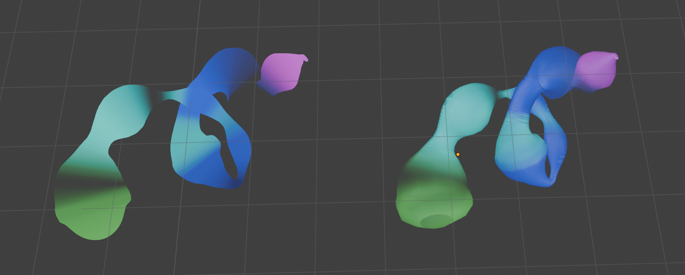
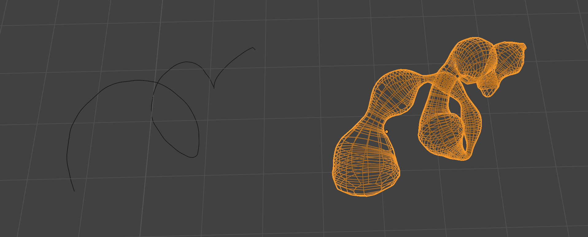
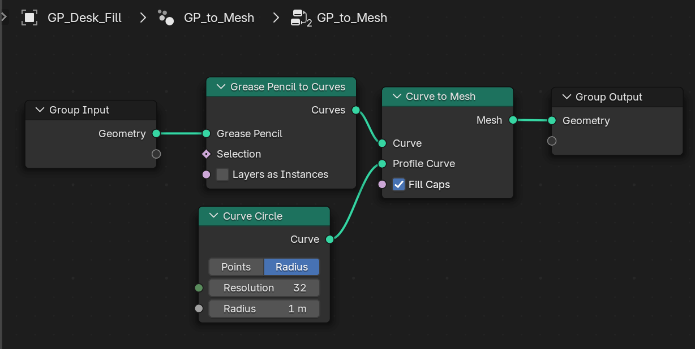
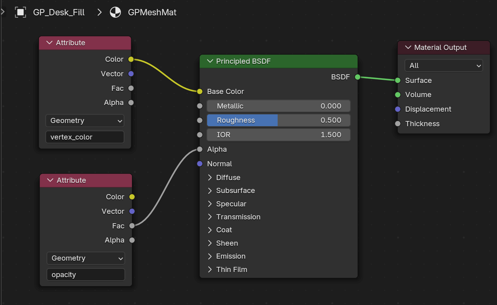
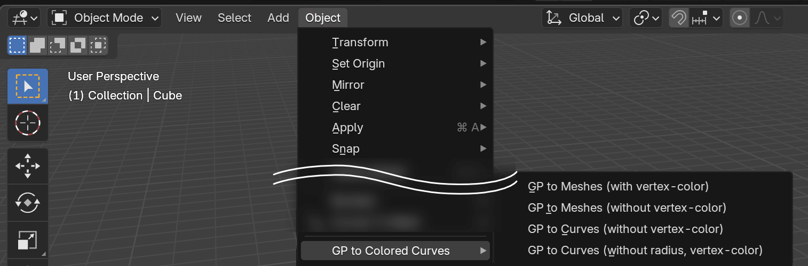
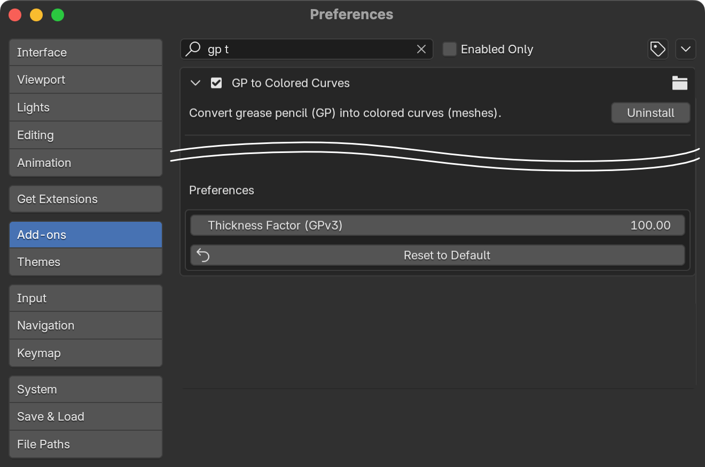
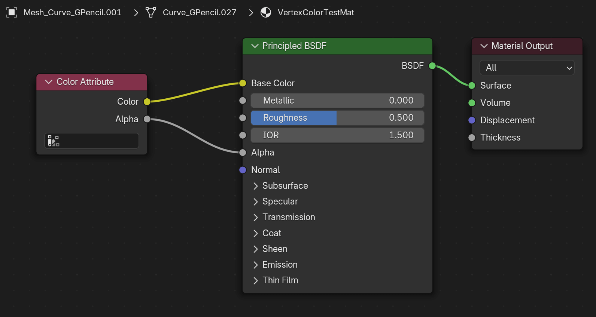

# GP to Colored Curves

Blender addon (Python script), Convert grease pencil (GP) into colored curves (meshes).

- GP's vertex-color, alpha/opacity (strength) and radius (thickness) are applied on converted meshes (**WARNING**: vertex-color and opacity are ONLY applied on meshes, not curves.)
- You can choose exporting meshes or curves (with radius or not). 

Tested on Blender 4.2 LTS ([GPv2](https://projects.blender.org/blender/blender/issues/114419)), 4.4 ([GPv3](https://projects.blender.org/blender/blender/issues/114419)).

### NOTE: "Grease Pencil to Curves Node" as an public alternative

On Blender 4.3+ you can also try Geometry Nodes named [Grease Pencil to Curves Node](https://docs.blender.org/manual/en/latest/modeling/geometry_nodes/curve/operations/grease_pencil_to_curves.html) as an (public) alternative, without installing this addon. (**WARNING**: This addon provides nearest the same functionality, but only provides Python script, not Geometry Nodes. )
  - Geometry Nodes example (for Blender 4.3+): 
  - Shader Nodes example (for Blender 4.3+): 

## Install

### From Releases (stable)

Check [Releases](https://github.com/funatsufumiya/GP_to_colored_curves/releases) and download ZIP files from there. (This may be older than latest, but maybe more stable.) Then drop it into Blender.

### From nightly (main branch, latest)

Download whole code from GitHub's ["Code > Download ZIP"](https://github.com/funatsufumiya/GP_to_colored_curves/archive/refs/heads/main.zip), and rename it to `GP_to_colored_curves.zip`, then drop it into Blender.

## Usage

- Select a grease pencil (GP) object in Object Mode,
- Execute a menu command at `Object > GP to Colored Curves > GP to Meshes (with vertex-color)`.
    - (You can also directly call it from F3 search menu, or make it favorite by right-click, or add shortcut-key ...etc).

## Preferences

- You can adjust `thickness_factor` in addon preferences. This is multiplication factor for curve radius.

## Known Issues

- Generated meshes have vertex colors (with alpha), but would not shown colors as default. You should create proper shader node for it (using `Color Attribute` node.)
    - Shader Nodes example: 
- Radius(es) may bigger or smaller because of unit difference (pixels and meters, on Blender 4.2 LTS)
    - Multiplication factor (`thickness_factor`) can be adjusted in addon preferences.
- Only strokes are supported. ***NOT*** fills for now.
    - As an workaround, convert to curves without radius and you can manually fill it (but vertex-colors will be lost).

## TODOs

- Curve profile adjustment
- Support fills in addition to strokes...?
